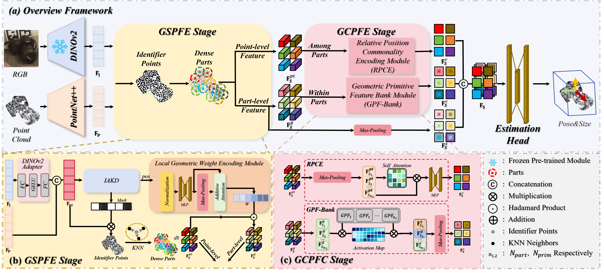

# Part-Pose: Balancing Specificity with Consistency in Part-Level Feature for Accurate and Robust Category-Level Object Pose Estimation
This repository contains the official implementation of "Part-Pose: Balancing Specificity with Consistency in Part-Level Feature for Accurate and Robust Category-Level Object Pose Estimation"

[[IEEE Xplore](https://ieeexplore.ieee.org/document/11523083)]

## Abstract
Category-level object pose estimation aims to recover the accurate poses of objects from predefined categories using only limited Computer-Aided Design (CAD) model priors. However, the prediction accuracy and robustness of the existing methods remain constrained by insufficient geometric representation capabilities and geometric structure inconsistencies caused by occlusions and intra-category shape variations, respectively. To address these limitations, we propose Part-Pose, a framework
designed to achieve accurate and robust pose estimation by leveraging a part-level feature representation that balances geometric
specificity with consistency. Our main innovations are embodied
in two stages. In the Geometrically Specific Part Feature Extraction stage, we introduce an object-adaptive dense part representation along with a Local Geometric Weight Encoding module to capture discriminating local structures, thereby providing
distinctive part-level features. In the Geometrically Consistent
Part Feature Construction stage, we propose a Geometric Primitive Feature Bank module, which extracts consistent geometric
structures shared across different instances and viewpoints to
form a set of universal geometric primitive features. Through a
flexible combination of these primitives, our method constructs
geometrically consistent features for any part. By leveraging
acquired part features that simultaneously preserve geometric
specificity and consistency, our method achieves accurate and
robust category-level pose estimation. Extensive comparative
experiments on challenging real-world datasets demonstrate that
the proposed Part-Pose outperforms state-of-the-art methods. In
addition, comprehensive ablation studies validate the necessity
of incorporating both geometric specificity and geometric consistency for the category-level pose estimation task.

## Pipeline

## Citation
```
@ARTICLE{11523083,
  author={Ye, Chenglin and Yu, Dongbo and Guo, Shuaichen and Xiao, Jun and Liu, Lupeng},
  journal={IEEE Transactions on Circuits and Systems for Video Technology}, 
  title={Part-Pose: Balancing Specificity with Consistency in Part-Level Feature for Accurate and Robust Category-Level Object Pose Estimation}, 
  year={2026},
  volume={},
  number={},
  pages={1-1},
  keywords={Modeling;Pose estimation;Modules (abstract algebra);Silicon;Computer vision;Computers;Shape;Conferences;Silver;Measurement;Object pose estimation;category-level;part-based representation;geometric feature},
  doi={10.1109/TCSVT.2026.3694196}}
```

## Environment Settings
The code has been tested with

- python 3.9
- torch 1.13
- cuda 11.7

Some dependencies:
```
pip install gorilla-core==0.2.5.3
pip install opencv-python

cd model/pointnet2
python setup.py install

cd ../..
pip install -r requirements.txt
```

For DINOv2 feature extraction: clone the [DINOv2](https://github.com/facebookresearch/dinov2) repo, download the ```dinov2_vits14_pretrain.pth``` weight, and set the correct path in ```model/net.py```.


## Data Processing
### NOCS dataset
- Download and preprocess the dataset following [DPDN](https://github.com/JiehongLin/Self-DPDN)
- Download and unzip the segmentation results [here](https://drive.usercontent.google.com/download?id=1RwAbFWw2ITX9mXzLUEBjPy_g-MNdyHET&export=download&authuser=0) from DualPoseNet

Put them under ```YOUR_DATA_DIR/data```and the final file structure is as follows:
```
data
├── camera
│   ├── train
│   ├── val
│   ├── train_list_all.txt
│   ├── train_list.txt
│   ├── val_list_all.txt
├── real
│   ├── train
│   ├── test
│   ├── train_list.txt
│   ├── train_list_all.txt
│   └── test_list_all.txt
├── segmentation_results
│   ├── CAMERA25
│   └── REAL275
├── camera_full_depths
├── gts
└── obj_models
```
### HouseCat6D
Download and unzip the dataset from [HouseCat6D](https://sites.google.com/view/housecat6d) and the final file structure is as follows:
```
HOUSECAT6D_DIR
├── scene**
├── val_scene*
├── test_scene*
└── obj_models_small_size_final
```

## Train
### Training on NOCS
```
python train.py --config config/REAL/camera_real.yaml
```
### Training on HouseCat6D
```
python train_housecat6d.py --config config/HouseCat6D/housecat6d.yaml
```

## Evaluate 
- Evaluate on NOCS:
```
python test.py --config config/REAL/camera_real.yaml --test_epoch 30
```
- Evaluate on HouseCat6D:
```
python test_housecat6d.py --config config/HouseCat6D/housecat6d.yaml --test_epoch 250
```

## Visualization
For visualization, please run
```
python visualize.py --config config/REAL/camera_real.yaml --test_epoch 30
```

## Acknowledgements
This work references the following open-source repositories:
- [NOCS](https://github.com/hughw19/NOCS_CVPR2019)
- [SPD](https://github.com/mentian/object-deformnet)
- [DualPoseNet](https://github.com/Gorilla-Lab-SCUT/DualPoseNet)
- [DPDN](https://github.com/JiehongLin/Self-DPDN)
- [VI-Net](https://github.com/JiehongLin/VI-Net)
- [HouseCat6D Toolbox](https://github.com/Junggy/HouseCat6D)
- [AG-Pose](https://github.com/Leeiieeo/AG-Pose)

We would like to express our sincere gratitude to the contributors.

## License
Our code is released under MIT License (see LICENSE file for details).
## Contact
yechenglin24@mails.ucas.ac.cn
